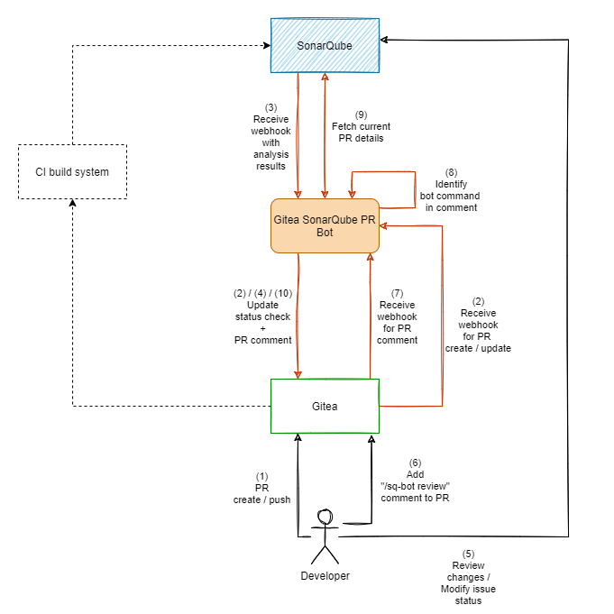

# Gitea SonarQube PR Bot

_Gitea SonarQube PR Bot_ is (obviously) a bot that receives messages from both SonarQube and Gitea to help developers 
being productive. The idea behind this project is the missing ALM integration of Gitea in SonarQube. Unfortunately, 
this [won't be added in near future](https://github.com/SonarSource/sonarqube/pull/3248#issuecomment-701334327). 
_Gitea SonarQube PR Bot_ aims to fill the gap between working on pull requests and being notified on quality changes. 
Luckily, both endpoints have a proper REST API to communicate with each others.

## Workflow

**Insights**

- Bot activities
    - extract data from SonarQube
        - Read payload from hook post to receive project,branch/pr,quality-gate
        - Reads "api/project_pull_requests" to get current issue counts and current state
        - Load "api/issues/search" to get detailed information for unresolved issues
        - Load "api/measures/component"
    - comment PR in Gitea (/repos/{owner}/{repo}/issues/{index}/comments)
        - stores mapping of repo+pr+comment-id in ?redis?
    - updates status check (either failing/success)
    - listen on "/sq-bot review" comments  
      -> updates comment (/repos/{owner}/{repo}/issues/comments/{id})  
      -> updates status check (either failing/success)

## Authentication

- Gitea
    - User with token to access the REST API
    - User needs "Read project" permissions with (??at least??) access to "Pull Requests"
- SonarQube
    - User with token to access the REST API
    - User needs "Browse on project" permissions

## Bot configuration

- SonarQube
    - Base URL
    - Token
    - Webhook Secret
- Gitea
    - Base URL
    - Token
    - Webhook Secret

## SonarQube configuration

- Add user with necessary permissions
- Create webhook pointing to the bot url (secure it with webhook secret)

## Gitea configuration

- Add user with necessary permissions
- Create webhook on a project/organization pointing to the bot url (secure it with webhook secret)
