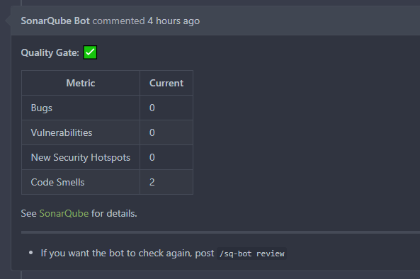
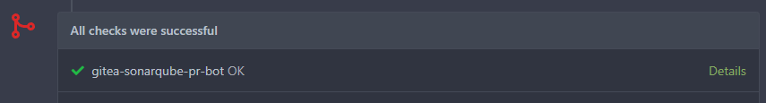

# Gitea SonarQube Bot

[](https://sonarcloud.io/dashboard?id=gitea-sonarqube-bot)
[](https://hub.docker.com/r/justusbunsi/gitea-sonarqube-bot)
[](https://artifacthub.io/packages/helm/gitea-sonarqube-bot/gitea-sonarqube-bot)


_Gitea SonarQube Bot_ is a bot that receives messages from both SonarQube and Gitea to help developers 
being productive. The idea behind this project is the missing ALM integration of Gitea in SonarQube. Unfortunately, 
this [won't be added in near future](https://github.com/SonarSource/sonarqube/pull/3248#issuecomment-701334327). 
_Gitea SonarQube Bot_ aims to fill the gap between working on pull requests and being notified on quality changes. 
Luckily, both endpoints have a proper REST API to communicate with each others.

- [Gitea SonarQube Bot](#gitea-sonarqube-bot)
  - [Workflow](#workflow)
  - [Requirements](#requirements)
  - [Bot configuration](#bot-configuration)
  - [Installation](#installation)
    - [Docker](#docker)
    - [Helm Chart](#helm-chart)
  - [Setup](#setup)
    - [SonarQube](#sonarqube)
    - [Gitea](#gitea)
    - [CI system](#ci-system)
  - [Changelog](#changelog)
  - [Contributing](#contributing)
  - [License](#license)
  - [Screenshots](#screenshots)

## Workflow


**Insights**

- Bot activities
    - Extract data from SonarQube
        - Read payload from hook post to receive project,branch/pr,quality-gate
        - Load "api/measures/component"
    - Comment PR in Gitea (/repos/{owner}/{repo}/issues/{index}/comments)
    - Updates status check (either failing/success)
    - Listen on "/sq-bot review" comments
      - Comment PR in Gitea (/repos/{owner}/{repo}/issues/{index}/comments)
      - Updates status check (either failing/success)

## Requirements

This bot is designed to perform SonarQube/SonarCloud API requests specific for pull requests. This feature is available in the _Community_ edition via [Sonarqube Community Branch Plugin](https://github.com/mc1arke/sonarqube-community-branch-plugin) or natively in [SonarQube _Developer_ edition](https://www.sonarsource.com/plans-and-pricing/) and above.

## Bot configuration

See [config.example.yaml](config/config.example.yaml) for a full configuration specification and description.

## Installation

### Docker

Create a directory `config` and place your [config.yaml](config/config.example.yaml) inside it. Open a terminal next to this directory
and execute the following (replace `$TAG` first):

```bash
docker run --rm -it -p 9000:3000 -v "$(pwd)/config/:/home/bot/config/" justusbunsi/gitea-sonarqube-bot:$TAG
```

**Starting with v0.2.0**

By default, the bot expects its configuration file under `./config/config.yaml` next to the bot executable. Inside the Docker image the
corresponding full path is `/home/bot/config/config.yaml`. If you prefer using a different location or even a different filename, you can
also define the environment variable `GITEA_SQ_BOT_CONFIG_PATH` that allows for changing that full path.

Imagine having a `./config/sqbot.config.yml` on your host that you want to populate inside `/mnt/`, the correct command to run a Docker
container would be:

```bash
docker run --rm -it -p 9000:3000 -e "GITEA_SQ_BOT_CONFIG_PATH=/mnt/sqbot.config.yml" -v "$(pwd)/config/:/mnt/" justusbunsi/gitea-sonarqube-bot:$TAG
```

### Helm Chart

See [Helm Chart README](helm/README.md) for detailed instructions.

## Setup

### SonarQube

- Create a user and grant permissions to "Browse on project" for the desired project
- Create a token for this user that will be used by the bot
- Create a webhook pointing to `https://<bot-url>/hooks/sonarqube`
- Consider securing it with a secret

### Gitea

- Create a user and grant permissions to "Read project" for the desired projects including access to "Pull Requests"
- Create a token for this user that will be used by the bot
- Create a project/organization/system webhook pointing to `https://<bot-url>/hooks/gitea`
- Consider securing the webhook with a secret

### CI system

Some CI systems may emulate a merge and therefore produce another, not yet existing commit hash that is promoted to SonarQube. 
This would cause the bot to fail to set the commit status in Gitea because the webhook sent by SonarQube contains that commit hash. 
To mitigate that situation, the bot will look inside the `properties` object for the key `sonar.analysis.sqbot`. If available, this 
key can contain the actual commit hash to use for updating the status in Gitea.  
See [SonarQube docs](https://docs.sonarqube.org/latest/project-administration/webhooks) for details.

## Changelog

See [CHANGELOG.md](./CHANGELOG.md) for a complete list of changes.

## Contributing

Expected workflow is: Fork -> Patch -> Push -> Pull Request

NOTES:

- **Please read and follow the [CONTRIBUTORS GUIDE](CONTRIBUTING.md).**

## License

This project is licensed under the MIT License. See the [LICENSE](LICENSE) file for the full license text.

---

## Screenshots

> Bot name and avatar depend on user configuration.



