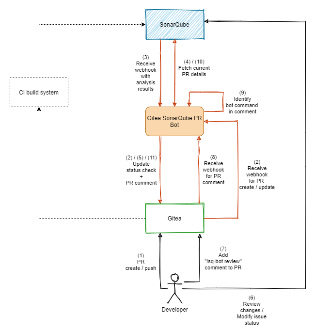

# Gitea SonarQube PR Bot

_Gitea SonarQube PR Bot_ is (obviously) a bot that receives messages from both SonarQube and Gitea to help developers 
being productive. The idea behind this project is the missing ALM integration of Gitea in SonarQube. Unfortunately, 
this [won't be added in near future](https://github.com/SonarSource/sonarqube/pull/3248#issuecomment-701334327). 
_Gitea SonarQube PR Bot_ aims to fill the gap between working on pull requests and being notified on quality changes. 
Luckily, both endpoints have a proper REST API to communicate with each others.

## Table of Contents

- [Gitea SonarQube PR Bot](#gitea-sonarqube-pr-bot)
  - [Workflow](#workflow)
  - [Setup](#setup)
  - [Bot configuration](#bot-configuration)
  - [Contributing](#contributing)
  - [License](#license)

## Workflow

**Insights**

- Bot activities
    - extract data from SonarQube
        - Read payload from hook post to receive project,branch/pr,quality-gate
        - Reads "api/project_pull_requests" to get current issue counts and current state
        - Load "api/issues/search" to get detailed information for unresolved issues
        - Load "api/measures/component"
    - comment PR in Gitea (/repos/{owner}/{repo}/issues/{index}/comments)
        - stores mapping of repo+pr+comment-id in ?redis?
    - updates status check (either failing/success)
    - listen on "/sq-bot review" comments  
      -> updates comment (/repos/{owner}/{repo}/issues/comments/{id})  
      -> updates status check (either failing/success)

## Setup

**SonarQube**  
- Create a user and grant permissions to "Browse on project" for the desired project
- Create a token for this user that will be used by the bot.
- Create a webhook pointing to `https://<bot-url>/sonarqube`. Consider securing it with a secret.

**Gitea**  
- Create a user and grant permissions to "Read project" for the desired projects including access to "Pull Requests"
- Create a token for this user that will be used by the bot.
- Create a project/organization/system webhook pointing to `https://<bot-url>/gitea`. Consider securing it with a secret.

## Bot configuration

See [config.example.yaml](config/config.example.yaml) for a full configuration specification and description.

## Contributing

Expected workflow is: Fork -> Patch -> Push -> Pull Request

NOTES:

- **Please read and follow the [CONTRIBUTORS GUIDE](CONTRIBUTING.md).**

## License

This project is licensed under the MIT License. See the [LICENSE](LICENSE) file for the full license text.
